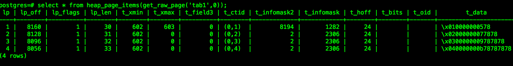
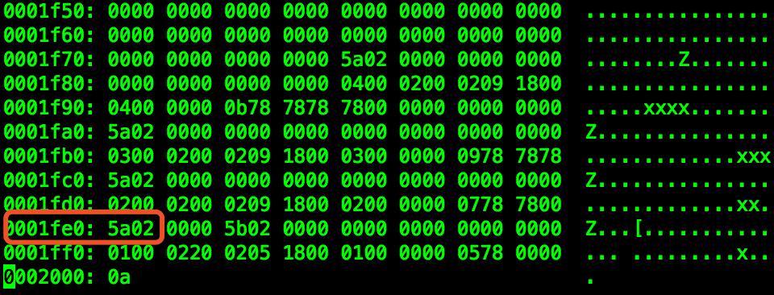
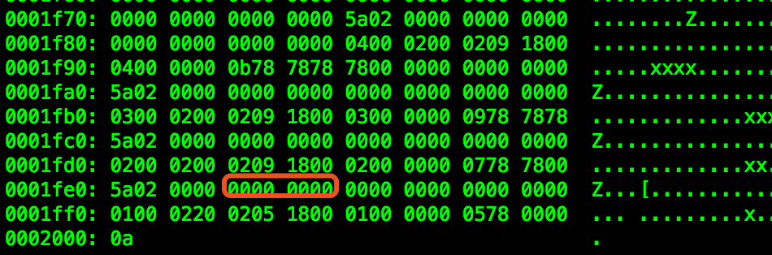
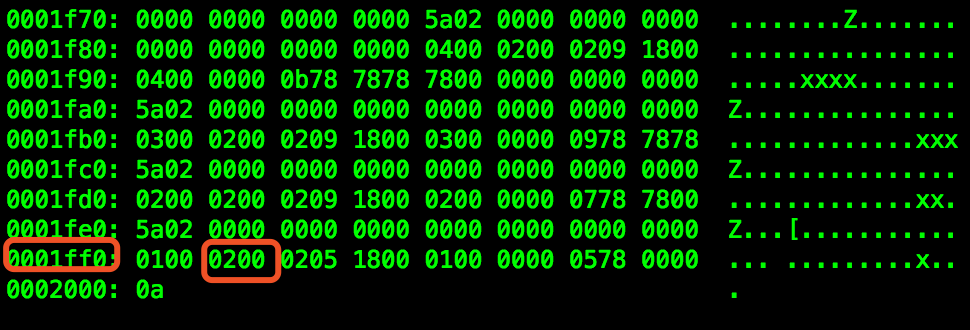
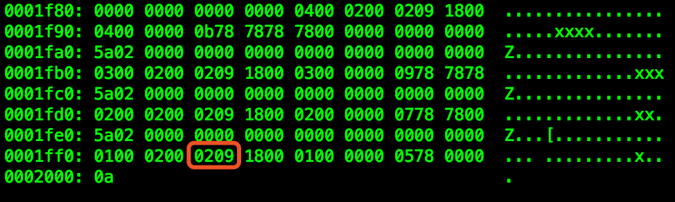

Pg的特殊恢复测试一例，在pg没有将dead tuple清理掉之前，只要数据还在，我们就可以通过修改t_xmax等信息来恢复tuple，本文仅是一次实验，恢复1条或者数条tuples，请勿在生产环境模拟本操作。

## 一、环境准备

### 1.1 创建测试表

```sql
postgres=# select version();
                                                 version                                                  
---------------------------------------------------------------------------
 PostgreSQL 11rc1 on x86_64-pc-linux-gnu, compiled by gcc (GCC) 4.8.5 20150623 (Red Hat 4.8.5-11), 64-bit
(1 row)

postgres=# create table tab1 (id int,name varchar(10));
CREATE TABLE
postgres=# insert into tab1 values(1,'x'),(2,'xx'),(3,'xxx'),(4,'xxxx');
INSERT 0 4
postgres=# select * from tab1;
 id | name 
----+------
  1 | x
  2 | xx
  3 | xxx
  4 | xxxx
(4 rows)

postgres=# 

(*pg默认是自动提交的)
```

### 1.2 用pageinspect查看

（前提是装了pageinspece 扩展）


我们只看与本次实验相关的部分：

t_xmax是删除或修改这个tuple的事务id，这里是0，说明这个tuple是可见的，正常的。我们删除一行tuple之后这里会存储删除tuple的事务id

t_infomask2表示字段数量和一些可变标志位，这里是2，更多具体值如下：

```c++
/*
 * information stored in t_infomask2:
 */
#define HEAP_NATTS_MASK			0x07FF	/* 11 bits for number of attributes */
/* bits 0x1800 are available */
#define HEAP_KEYS_UPDATED		0x2000	/* tuple was updated and key cols
										 * modified, or tuple deleted */
#define HEAP_HOT_UPDATED		0x4000	/* tuple was HOT-updated */
#define HEAP_ONLY_TUPLE			0x8000	/* this is heap-only tuple */

#define HEAP2_XACT_MASK			0xE000	/* visibility-related bits */
```

t_infomask表示标志位，这里是2306，十六进制就是0x0902，分别就是

```c++
#define HEAP_XMIN_COMMITTED		0x0100	/* t_xmin committed */
#define HEAP_XMAX_INVALID		0x0800	/* t_xmax invalid/aborted */
#define HEAP_HASVARWIDTH		0x0002	/* has variable-width attribute(s) */
```

完整的含义如下：

```c++
/*
 * information stored in t_infomask:
 */
#define HEAP_HASNULL			0x0001	/* has null attribute(s) */
#define HEAP_HASVARWIDTH		0x0002	/* has variable-width attribute(s) */
#define HEAP_HASEXTERNAL		0x0004	/* has external stored attribute(s) */
#define HEAP_HASOID				0x0008	/* has an object-id field */
#define HEAP_XMAX_KEYSHR_LOCK	0x0010	/* xmax is a key-shared locker */
#define HEAP_COMBOCID			0x0020	/* t_cid is a combo cid */
#define HEAP_XMAX_EXCL_LOCK		0x0040	/* xmax is exclusive locker */
#define HEAP_XMAX_LOCK_ONLY		0x0080	/* xmax, if valid, is only a locker */

 /* xmax is a shared locker */
#define HEAP_XMAX_SHR_LOCK	(HEAP_XMAX_EXCL_LOCK | HEAP_XMAX_KEYSHR_LOCK)

#define HEAP_LOCK_MASK	(HEAP_XMAX_SHR_LOCK | HEAP_XMAX_EXCL_LOCK | \
						 HEAP_XMAX_KEYSHR_LOCK)
#define HEAP_XMIN_COMMITTED		0x0100	/* t_xmin committed */
#define HEAP_XMIN_INVALID		0x0200	/* t_xmin invalid/aborted */
#define HEAP_XMIN_FROZEN		(HEAP_XMIN_COMMITTED|HEAP_XMIN_INVALID)
#define HEAP_XMAX_COMMITTED		0x0400	/* t_xmax committed */
#define HEAP_XMAX_INVALID		0x0800	/* t_xmax invalid/aborted */
#define HEAP_XMAX_IS_MULTI		0x1000	/* t_xmax is a MultiXactId */
#define HEAP_UPDATED			0x2000	/* this is UPDATEd version of row */
#define HEAP_MOVED_OFF			0x4000	/* moved to another place by pre-9.0
										 * VACUUM FULL; kept for binary
										 * upgrade support */
#define HEAP_MOVED_IN			0x8000	/* moved from another place by pre-9.0
                                         * VACUUM FULL; kept for binary
                                         * upgrade support */
```


## 二、删除一个tuple

删除一行

```
postgres=# select * from tab1;
 id | name 
----+------
  1 | x
  2 | xx
  3 | xxx
  4 | xxxx
(4 rows)

postgres=# delete from tab1 where id=1;
DELETE 1
postgres=# select * from tab1;
 id | name 
----+------
  2 | xx
  3 | xxx
  4 | xxxx
(3 rows)sql
```

pageinspect再次查看


这里xmax从0变成了603，就是删除这个tuple的事务id

t_infomask2变成了8194，十六进制就是0x2002，较之前的2，增加了0x2000。表示tuple被更新或者删除了

```c++
#define HEAP_KEYS_UPDATED		0x2000	/* tuple was updated and key cols
										 * modified, or tuple deleted */
```

t_infomask变成了1282，十六进制就是0x0502

```c++
#define HEAP_XMIN_COMMITTED		0x0100	/* t_xmin committed */
#define HEAP_XMAX_COMMITTED		0x0400	/* t_xmax committed */
#define HEAP_HASVARWIDTH		0x0002	/* has variable-width attribute(s) */
```

从pageinspect来看的话，我们只要把这三个位置改回去就好了（实际生产环境的情况可能要复杂得多，这里不去具体讨论了）


## 三、准备恢复

### 3.1 找到需要恢复的page

```sql
postgres=# select pg_relation_filepath('tab1');
 pg_relation_filepath 
----------------------
 base/13285/16434
(1 row)
postgres=# 

[pg11rc@whf307 ~]$ echo $PGDATA
/oracle/soft/pg11rc_data/
[pg11rc@whf307 ~]$ ls -rtl /oracle/soft/pg11rc_data/base/13285/16434
-rw------- 1 pg11rc pg11rc 8192 Nov  2 16:00 /oracle/soft/pg11rc_data/base/13285/16434
```

### 3.2 备份page

```shell
[pg11rc@whf307 ~]$ cp /oracle/soft/pg11rc_data/base/13285/16434 /oracle/soft/pg11rc_data/base/13285/16434.bak
```

### 3.3 关闭实例

```
[pg11rc@whf307 ~]$ pg_ctl stop -m fast
waiting for server to shut down.... done
server stopped
```


## 四、 开始恢复

### 4.1 偏移量和长度

我们再来看看之前pageinspect看到的结果



关于page的结构在另外一篇文章有说明，或者网上也有很多类似的文章，很容易搜到。

t_xmin在offset 8160（lp_off）的位置，长度4 bytes，所以**t_xmax**是**8164~8167** 的4 bytes。

t_field3是4 bytes，t_ctid是6 bytes。所以**t_infomask2**是**8178~8179** 的2个bytes。

**t_infomask**也是2个bytes，在**8180~8181**。

### 4.2 用vi来编辑修改

Linux下有很多十六进制编辑工具，比如hexedit、ghex2、vi 等等，这里我们用vi来修改，输入**:%!xxd** 就进入十六进制模式了（再返回原来模式用**:%!xxd -r**），如下：



用G直接到文件尾，linux下所有的文件都是0a结尾的，文件大小是没有问题的，每行**16**个bytes（两个十六进制位是一个byte ）。

**0x1fe0**就是十进制的8160，按照我们上面说的，接下来4 bytes是t_xmin。我们从vi里面看到的是0x5a020000，这里是大端，正确的应该是0x0000025a，十进制就是**602**了，跟我们之前pageinspect看到的结果一致。

**t_xmax**

接下来是t_xmax 4 bytes，我们可以看到它是0x5b020000，同样正确的是0x0000025b，十进制603，这里我们修改成0x00000000，如下:



**t_infomask2**

接下来是t_infomask2，根据上面分析的在8178和8179的偏移，下面一行是0x1ff0开头，十进制就是8176。所以t_infomask2就是接下来的0x0220，同样，正确的存储应该是0x2002，十进制就是8194，和pageinspect看到的也是一致，我们修改为2，十六进制就是0x0002，大端应该就是0x0200，修改如下：



**t_infomask**

修改了t_infomask2之后t_infomask的修改应该很熟悉了，接下来两个字节，0x0205，正确的是0x0502，十进制1282，和pageinspect看到的也是一致，我们修改成2306，十六进制0x0902，反过来（大端）就是0x0209，修改如下：



保存退出

### 4.3 启动实例查看数据

我们启动数据库看看数据回来了没有

```sql
[pg11rc@whf307 ~]$ pg_ctl start -l ./server.log 
waiting for server to start.... done
server started
[pg11rc@whf307 ~]$ psql -p 5431 -U pg11rc
psql (11rc1)
Type "help" for help.

postgres=# select * from tab1;
 id | name 
----+------
  1 | x
  2 | xx
  3 | xxx
  4 | xxxx
(4 rows)

postgres=# 
```


## 五、关于

#### 5.1 本文只是一个测试，请勿在生产环境模拟或做类似的操作

#### 5.2 如果data_checksums为true的话，这种方法修改后cheksum检测是过不了的

#### 5.3 不停库也可以，只是pg不能像oracle那样刷新shared buffer（同Oracle buffer cache），修改后还是会去读原来的buffer
